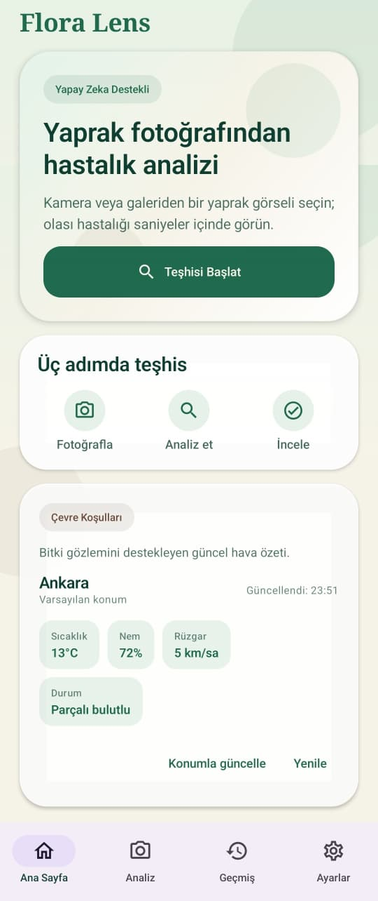
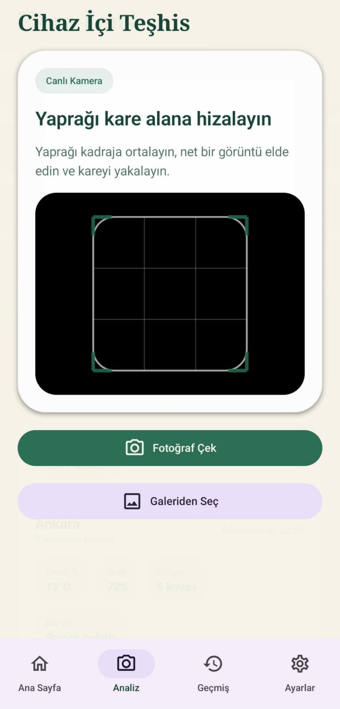
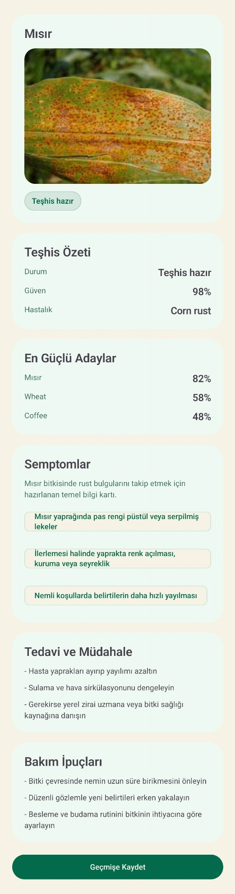
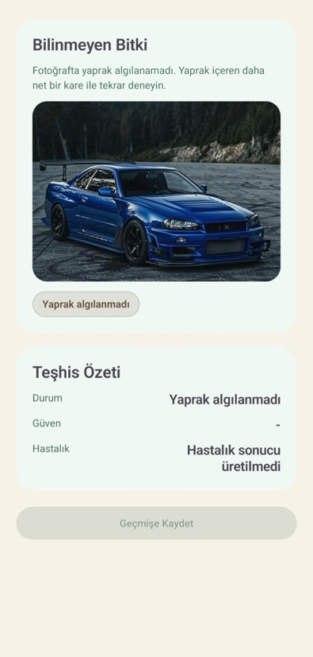
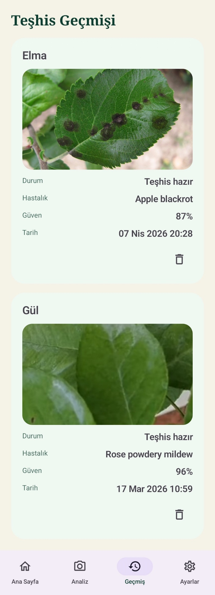
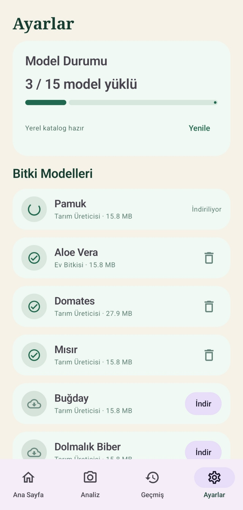
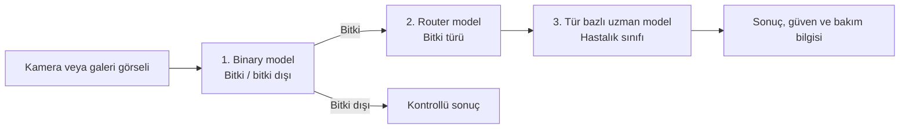

# Flora Lens

**Tarımsal ve Süs Bitkisi Hastalıklarının Yapay Zeka Tabanlı Mobil Uygulama ile Tespit Edilmesi**

[](https://tubitak.gov.tr/)


[](https://github.com/Kscl1/flora-lens/releases/latest)

Flora Lens, bir yaprak fotoğrafından bitki hastalıkları için **ön değerlendirme** üreten bir Android **karar destek prototipidir**. Analiz tamamen cihaz üzerinde çalışır; yaprak görselleri hastalık analizi için hiçbir sunucuya gönderilmez. Uygulama, tarımsal üreticiler ve bireysel bitki yetiştiricileri için tasarlanmıştır.

Proje, **TÜBİTAK 2209-A Üniversite Öğrencileri Araştırma Projeleri Destek Programı** kapsamında **Karamanoğlu Mehmetbey Üniversitesi**'nde yürütülmüştür. Bu depo, araştırma kapsamında geliştirilen mobil uygulamanın kamuya açık indirme ve bilgilendirme sayfasıdır.

> **Uyarı:** Flora Lens profesyonel tarımsal teşhisin yerine geçmez; sonuçların doğruluğu bitki türüne göre değişir. Ayrıntılar için [Sınırlılıklar](#sınırlılıklar) bölümüne bakın.

---

## Uygulamayı İndir

En güncel Android sürümünü [**GitHub Releases**](https://github.com/Kscl1/flora-lens/releases/latest) sayfasından indirebilirsiniz.

| Dosya | Açıklama |
| --- | --- |
| `flora-lens-arm64-v8a.apk` | 64-bit ARM (`arm64-v8a`) cihazları destekleyen imzalı APK |
| `SHA256SUMS.txt` | İndirilen APK'nın bütünlük kontrolü |

- **Gereksinim:** Android 11 veya daha yeni bir sürüm
- **APK boyutu:** yaklaşık 75,0 MiB (78,6 MB)

### Kurulum

1. Releases sayfasından `flora-lens-arm64-v8a.apk` dosyasını indirin.
2. Android isterse tarayıcınız veya dosya yöneticiniz için “bilinmeyen uygulama yükleme” iznini açın.
3. APK'yı çalıştırarak kurulumu tamamlayın.
4. Uygulamadaki **Ayarlar** ekranından ihtiyaç duyduğunuz bitkiye ait uzman modeli indirin.

APK bütünlüğünü Windows PowerShell ile doğrulamak için:

```powershell
Get-FileHash .\flora-lens-arm64-v8a.apk -Algorithm SHA256
```

Üretilen değeri release içindeki `SHA256SUMS.txt` ile karşılaştırın.

---

## Ekran Görüntüleri

<table>
  <tr>
    <td align="center"><br><strong>Ana ekran</strong></td>
    <td align="center"><br><strong>Görsel seçimi</strong></td>
  </tr>
  <tr>
    <td align="center"><br><strong>Teşhis sonucu</strong></td>
    <td align="center"><br><strong>Kontrollü bitki dışı sonuç</strong></td>
  </tr>
  <tr>
    <td align="center"><br><strong>Teşhis geçmişi</strong></td>
    <td align="center"><br><strong>Model yönetimi</strong></td>
  </tr>
</table>

---

## Projenin Amacı

Çalışmanın başlangıç hedefi, YOLO tabanlı canlı nesne tespiti ile CNN tabanlı hastalık sınıflandırmasını bir mobil uygulamada birleştirmekti. Teknik değerlendirmeler sonucunda, yaprak üzerindeki leke, renk ve doku ayrıntılarını daha iyi koruyan **yüksek çözünürlüklü statik fotoğrafların** bu problem için daha uygun olduğuna karar verildi.

Bu karar sonrasında sistem, tek bir modelin bütün problemi çözmeye çalıştığı yapı yerine **üç aşamalı hiyerarşik bir mimariye** dönüştürüldü:



Böylece her bitki için ayrı bir uzman model kullanılabildi ve tek modelli yaklaşıma kıyasla daha yüksek başarım elde edildi.

---

## Veri Seti ve Model Çalışmaları

Proje kapsamında Kaggle, Mendeley Data, Roboflow, Cornell University ve farklı ekolojik kaynaklardan derlenen veriler temizlenerek özgün bir **ana veri seti (Master Dataset)** oluşturuldu.

| Araştırma çıktısı | Değer |
| --- | ---: |
| Toplam görüntü | 10.886 |
| Ana kategori | 17 (16 bitki + bitki dışı) |
| Alt sınıf | 63 |
| Mobil uygulamada desteklenen uzman model | 15 |

Model geliştirme sürecinde EfficientNet-B0/B2, ResNet18, MobileNetV3, VGG16 ve DenseNet121 mimarileri karşılaştırıldı. Model seçimi yalnız doğruluk değerine göre değil; sınıf dengesizliğine daha duyarlı **makro F1-skoru**, model boyutu, hesaplama maliyeti ve mobil çalışabilirlik birlikte değerlendirilerek yapıldı.

### Aşama Başarımları

**1. ve 2. aşama (ön filtreleme):**

- **Binary model** (bitki / bitki dışı ayrımı), araştırma test kümesinde yaklaşık **%99 makro F1** değerine ulaştı.
- **Router model** (bitki türü ayrımı), araştırma test kümesinde yaklaşık **%99 makro F1** değerine ulaştı.

> Bu `%99` değerleri yalnızca ilk iki aşamaya (bitki/tür ayrımı) aittir; sistemin uçtan uca hastalık teşhisi doğruluğu değildir. Asıl teşhis, aşağıdaki uzman modellerle yapılan üçüncü aşamada gerçekleşir.

**3. aşama (uzman modeller — hastalık sınıflandırması):**

| Bitki | Seçilen model | Makro F1 |
| --- | --- | ---: |
| Elma | EfficientNet-B0 | %96,7 |
| Fasulye | ResNet18 | %97,8 |
| Manyok | MobileNetV3 | %63,8 |
| Kahve | ResNet18 | %89,9 |
| Mısır | EfficientNet-B0 | %96,0 |
| Pamuk | MobileNetV3 | %87,4 |
| Salatalık | EfficientNet-B0 | %84,0 |
| Üzüm | EfficientNet-B0 | %97,0 |
| Dolmalık biber | EfficientNet-B0 | %95,0 |
| Patates | EfficientNet-B0 | %97,3 |
| Gül | MobileNetV3 | %97,1 |
| Şeker kamışı | EfficientNet-B0 | %93,0 |
| Domates | DenseNet121 | %62,0 |
| Buğday | EfficientNet-B0 | %94,0 |
| Aloe vera | EfficientNet-B0 | %73,9 |

Uzman model başarımı araştırma test kümelerinde yaklaşık **%62 ile %98 arasında** değişmektedir. Domates, manyok ve aloe vera gibi bazı türlerde sınıflar arası görsel benzerlik nedeniyle performans daha düşüktür. **Pirinç**, veri setindeki ayrıştırılabilirliğin daha da düşük bulunması nedeniyle final mobil teşhis kapsamına alınmamıştır.

---

## Mobil Uygulama

Android uygulaması **Kotlin** ve **Jetpack Compose** ile geliştirildi. Model çıkarımı cihaz üzerinde **ONNX Runtime Android** ile gerçekleştirilir.

Başlıca işlevler:

- Kamera veya galeriden yaprak görseli seçme
- Cihaz üzerinde `binary -> router -> expert` teşhis akışı
- Bitki dışı, düşük güvenli veya eksik model durumlarında kontrollü sonuç gösterimi
- Bitki türüne göre uzman model indirme, silme ve yeniden kurma
- Hastalık, güven, semptom ve bakım bilgilerinin sunulması
- Teşhisleri görselleriyle birlikte yerel geçmişe kaydetme
- Güncel çevre koşullarını gösteren, isteğe bağlı konum destekli hava özeti

### Desteklenen Bitkiler

Uygulama toplam 15 bitki türünü destekler:

- **Ev / süs bitkileri:** Aloe vera, Gül
- **Tarımsal bitkiler:** Elma, Fasulye, Kahve, Mısır, Pamuk, Salatalık, Üzüm, Dolmalık biber, Patates, Şeker kamışı, Domates, Buğday, Manyok

---

## Mobil Mühendislik Kararları

### ONNX Runtime ve ExecuTorch Karşılaştırması

Modeller önce ExecuTorch `.pte` formatıyla Android üzerinde çalıştırıldı. Modellerin tahmin çıktısı üretebildiği doğrulandıktan sonra aynı cihazda ONNX Runtime ile karşılaştırmalı performans ölçümleri yapıldı.

| Ölçüm | ONNX Runtime | ExecuTorch | Yaklaşık fark |
| --- | ---: | ---: | ---: |
| Binary model | 92 ms | 4.135 ms | 45x |
| Router model | 38 ms | 3.334 ms | 88x |
| Elma uzman modeli | 48 ms | 1.421 ms | 30x |
| Tam teşhis akışı | 288 ms | 8.870 ms | 31x |

Ölçümler SM-A566B model Android cihazda, ilk model yükleme adımından sonraki ardışık çalıştırmalar sırasında alınmıştır. Bu sonuçlar doğrultusunda üretim çıkarım altyapısı olarak ONNX Runtime seçilmiştir.

### Hibrit Model Dağıtımı

Tüm uzman modelleri APK içine ekleyen ilk yaklaşım, uygulama boyutunu yaklaşık `406 MB` seviyesine çıkardı. Bu nedenle ortak binary/router modelleri uygulama paketinde tutulurken 15 bitki uzman modelinin ihtiyaç halinde indirilebildiği **hibrit dağıtım** yapısına geçildi.

İndirilen modeller uygulama tarafından dosya boyutu ve **SHA-256** özetiyle doğrulanır. Model deposu ve depolama erişimi kamuya açık değildir; uygulama yalnız kontrollü model gateway'i üzerinden katalogda izin verilen dosyalara erişir.

---

## Doğrulama

Mobil doğrulama, **model doğruluk testlerinden ayrı olarak**, uygulamanın farklı girdi türlerinde güvenli ve kararlı çalışmasını değerlendirmek amacıyla yürütüldü.

- 81 yaprak, desteklenmeyen bitki ve bitki dışı görsel Android teşhis hattından geçirildi.
- Bu matris sırasında teknik uygulama çökmesi veya çıkarım hatası gözlenmedi.
- Gerçek Android cihazda katalog yenileme, model indirme, SHA-256/boyut doğrulama, model silme, yeniden indirme ve offline hata davranışları kontrol edildi.
- Home, Scan, Result, History ve Settings akışları gerçek cihaz ve Android sanal cihaz üzerinde değerlendirildi.

> Bu çalışma bir **model doğruluk benchmark'ı değildir**; uygulama hattının farklı girdilerde teknik olarak kararlı çalıştığını sınar. Model başarımı için [Aşama Başarımları](#aşama-başarımları) bölümüne bakın.

---

## Teknik Yapı

| Katman | Teknoloji / yaklaşım |
| --- | --- |
| Android | Kotlin, Jetpack Compose, Material 3 |
| Mimari | ViewModel, UseCase, Repository, Hilt |
| Cihaz içi çıkarım | ONNX Runtime Android |
| Yerel veri | Room, uygulamaya özel dosya depolama |
| Görsel seçimi | CameraX, Android Photo Picker |
| Model dağıtımı | Private Cloudflare R2 + Worker gateway |
| Hava verisi | Open-Meteo |

---

## Gizlilik ve Kapsam

- Yaprak görselleri teşhis için bir sunucuya yüklenmez; çıkarım cihaz üzerinde yapılır.
- Kamera izni yalnız fotoğraf çekimi için kullanılır.
- Yaklaşık konum izni isteğe bağlıdır ve yalnız çevre koşullarını yerelleştirmek için kullanılır; izin verilmezse varsayılan olarak Ankara verisi gösterilir.
- Teşhis geçmişi ve indirilen modeller uygulamanın yerel alanında tutulur.
- Model, katalog ve hava durumu isteklerinde hizmet sağlayıcıların standart teknik ağ kayıtları oluşabilir.

Ayrıntılı bilgi için [Gizlilik Bilgilendirmesi](PRIVACY.md) dosyasını inceleyin.

---

## Sınırlılıklar

- Hastalık teşhisi başarımı bitki türüne göre belirgin biçimde değişir; domates, manyok ve aloe vera gibi türlerde uzman model performansı düşüktür (bkz. [Aşama Başarımları](#aşama-başarımları)).
- Sistem yalnızca desteklenen 15 bitkiyi tanır; **pirinç** düşük ayrıştırılabilirlik nedeniyle kapsam dışıdır ve kapsam dışı bitkilerde anlamlı sonuç üretilmez.
- Uzman modeller ilk kullanımda internet üzerinden indirilir; ikili ve yönlendirici modeller uygulamayla birlikte gelir.
- Metrikler kontrollü araştırma veri setlerine aittir; ışık, açı, kadraj ve arka plan gibi saha koşulları sonuçları etkileyebilir.
- Düşük güvenli veya belirsiz durumlarda uygulama kesin sonuç yerine kontrollü bir çıktı gösterir.

---

## Proje Ekibi

| İsim | Rol |
| --- | --- |
| Elif Kartal | Proje yürütücüsü |
| Hamdi Eren Kuşcalı | Proje üyesi |
| Dr. Öğr. Üyesi İbrahim Çınaroğlu | Proje danışmanı |

---

## Akademik Kullanım ve Atıf

Bu depo, TÜBİTAK 2209-A projesi kapsamında geliştirilen mobil prototipin dağıtım sayfasıdır. Projeye ilişkin yayın veya makale bilgisi kesinleştiğinde bibliyografik künye ve atıf bilgileri bu bölüme eklenecektir.

---

## Lisans ve Dağıtım

Bu depo yalnızca uygulamanın indirilebilir APK'sını ve kullanıcı dokümantasyonunu yayımlar. Kaynak kodu ve model ağırlıkları bu dağıtımın parçası değildir. Açık kaynak lisansı ayrıca belirtilmedikçe içeriklerin tüm hakları saklıdır ve yeniden dağıtım hakkı verilmiş sayılmaz.

© 2026 Flora Lens proje ekibi. Tüm hakları saklıdır.
